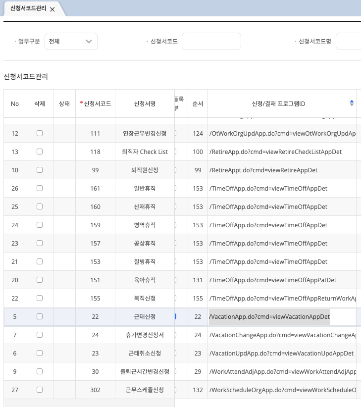

# 개발 가이드
> 개발 명명 규칙 [필독]
```text
화면/팝업 : cmd=view
조회 : cmd=get
쓰기 : cmd=save , cmd=prc, cmd=delete, cmd=update
화면에서 의 예외 : cmd=exc
```
## 모달 사이즈 정의
모달 사이즈를 정의하는 방법은 두가지가 있습니다.
1) 신청서의 너비는 해당 메뉴에서 너비를 정의할 수 있습니다.<br>
신청결재 > 신청결재관리 > 신청서코드관리<br>
코드관리표에서 신청서 넓이, 신청서 높이 에서 신청서 모달의 사이즈를 선택하면 됩니다.
<br><br>
2) 신청서가 아닌 직접 modal 사이즈를 class 명명으로 사이즈를 정의하고 싶은 경우
- - -
> 모달 너비 별 클래스
```html
div#layerModalWrap div.modal-size.width-sm{
    width: 25rem;/* width: 300px */
}
div#layerModalWrap div.modal-size.width-md{
    width: 42rem;/* width: 504px */
}
div#layerModalWrap div.modal-size.width-lg{
    width: 67rem;/* width: 804px */
}
div#layerModalWrap div.modal-size.width-xl{
    width: 95rem;/* width: 1140px */
}
div#layerModalWrap div.modal-size.width-full{
    width: 100%;/* width: 100% */
}
```
> 모달 높이 별 클래스
```html
div#layerModalWrap div.modal-size.height-sm{
    height: 24rem;/* height: 288px */
}
div#layerModalWrap div.modal-size.height-md{
    height: 37.5rem;/* height: 450px */
}
div#layerModalWrap div.modal-size.height-lg{
    height: 54rem;/* height: 648px */
}
div#layerModalWrap div.modal-size.height-xl{
    height: 70rem;/* height: 840px */
}
div#layerModalWrap div.modal-size.height-full{
    height: 100%;/* height: 100% */
    max-height: 100vh;
}
```
> 페이지 전체 모달
```html
div#layerModalWrap div.modal-size.modal-full{
    width: 100%;
    height: 100%;
    max-height: 100vh;
    border-radius:0;
}
```
## JSP 
- - -
> UX 관련
```html
*기존
<td><span>타이틀 라벨</span>
    <select/>
    <input/> 등
</td>
*변경
<th>타이틀 라벨</th>
<td>
    <select/>
    <input/>
</td>
```
> layerModal popup
```javascript
    //commonLayer.jsp
    function LayerModal(options){
        this.id         = options.id || generateId();//ID
        this.width      = options.width || 300;//가로 크기
        this.height     = options.height || 200;//세로 크기
        this.modalWrap  = null;
        this.background = null;//background
        this.modal      = null;
        this.parent     = window.document.getElementById('layerModalWrap');
        this.contentWrap    = null;
        this.content    = '';//modal 내용
        this.contentUrl = options.url || '';
        this.html       = options.html || '';
        this.parameters = options.parameters || {};
        this.triggerList = [];
        if(options.trigger){
            this.addTrigger(options.trigger);
        }
        this.callback   = options.callback || null;
        this.isShow     = false;
        this.title      = options.title || '';
        this.destroyCallback    = null;
        this.init();
    }
    
    //사용하는 jsp
    let layerModal = new window.top.document.LayerModal({
        id : 'empInfoChangeReqLayer' //식별자ID
        , url : '/Popup.do?cmd=viewEmpInfoChangeReqLayer&authPg=A' //팝업에 띄울 화면 jsp
        , parameters : {"param1" : "value1"}
        , width : 740
        , height : 520
        , title : '팝업 타이틀 신청'
        , trigger :[ //콜백
            {
                name : 'empInfoChangeReqTrigger'
                , callback : function(result){
                }
            }
        ]
    });
    layerModal.show();
    
    //모달 JSP empInfoChangeReqLayer.jsp , orgBasicLayer.jsp 참조 
    //모달에서 부모 페이지로 콜백 함수 호출 예제
    const modal = window.top.document.LayerModalUtility.getModal('empInfoChangeReqLayer'); //모달 선언시 사용한 ID
    modal.fire('empInfoChangeReqTrigger', [{ //모달 선언시 사용한 트리거 명
        orgCd : mySheet.GetCellValue(Row, "orgCd")
        , orgNm : mySheet.GetCellValue(Row, "orgNm")
        , sdate : mySheet.GetCellValue(Row, "sdate")
        , edate : mySheet.GetCellValue(Row, "edate")
        , orgEngNm : mySheet.GetCellValue(Row, "orgEngNm")
        , orgType : mySheet.GetCellValue(Row, "orgType")
        , inoutType : mySheet.GetCellValue(Row, "inoutType")
        , objectType : mySheet.GetCellValue(Row, "objectType")
        , locationCd : mySheet.GetCellValue(Row, "locationCd")
    }]).hide();
```
> Layer Modal Sheet 깨짐
```javascript
    //높이 지정 
    var sheetHeight = $(".modal_body").height() - $("#sheet1Form").height() - $(".sheet_title").height() - 2;
    sheet1.SetSheetHeight(sheetHeight);

```
RD 작업 시 rp 파람 [ http://ehrdemo.isusystem.co.kr:8180 ]  >> [http://ehrdemo.isusystem.co.kr:8180] 공백없이 작성해야합니다. 이미지 안뜨는 문제는 요건으로 인사카드 출력은 됩니다.
Layer 팝업에서 authPg 사용 시 버튼 컨트롤이 적용 안될 경우 ajax.jsp 포함시켜사용하세요~


> XSS 관련 - lucy filter
```html
*기존
var runType = "'A','B','C'";
*변경

var runType = "A,B,C"; >> runType = [A,B,C] 가 맞지만 전송 형태가 JSON 전송 방식이 아니여서 DAO.java에서 String[]로 변경
var runType = "A,";

```
```xml
    <!-- lucy-xss-servlet-filter-rule.xml global 필터링 룰 선언 예외 처리 -->
    <global>
        <!-- 모든 url에서 들어오는 authPg 파라메터는 필터링 되지 않는다
        globalPrefixParameter로 시작하는 파라메터도 필터링되지 않는다.-->
        <params>
            <param name="authPg" useDefender="false" />
            <param name="globalParameter" useDefender="false" />
            <param name="globalPrefixParameter" usePrefix="true" useDefender="false"/>
        </params>
    </global>
```
```java
    //예외처리가 필요한 파라메터는 저장 Controller 도입부에서 치환해준다.
    String sqlTxt = XssPreventer.unescape(paramMap.get("adminSqlSyntax").toString());
```
```java
//DAO.java Error evaluating expression
public static Object convertParams(Object params) {
        Object convert = null;
        if (params instanceof Map) {
            Map<String, Object> convertmap = (Map<String, Object>) params;
            String[] ssnKeys = new String[] { "ssnEnterCd", "ssnLocaleCd", "ssnSearchType", "ssnGrpCd", "ssnBaseDate", "ssnSabun", "ssnEncodedKey", "ssnAdminYn" };
            String[] excKeys = new String[] { "selectColumn", "selectViewQuery"};
            Arrays.stream(ssnKeys).forEach(key ->  convertmap.put(key, SessionUtil.getRequestAttribute(key)));
            Iterator<String> it = convertmap.keySet().iterator();
            while(it.hasNext()){
                String k = it.next();
                Object v = convertmap.get(k);
                if (v instanceof String && !Arrays.asList(excKeys).contains(k) && !k.startsWith("log") && v != null && !v.equals("") && ((String) v).indexOf(",") != -1) {
                    convertmap.put(k,((String) v).split(","));
                }
            }
            convert = convertmap;
        } else {
            convert = params;
        }
        return convert;
}
```
> [anyframe 제거 관련]
>>기존 JSP에서 참조하고 있던 anyframe 함수를 DateUtil.java에 재 구현 필요

```java
    //JSP import
    <%@ page import="com.hr.common.util.DateUtil" %>

    <%=DateUtil.addDays(DateUtil.getCurrentTime("yyyy-MM-dd"),-30)%>
    <%=DateUtil.getCurrentTime("yyyy-MM-dd")%>
        .. 등
        
   package com.hr.common.util.DateUtil; //추가 구현
```

> RD 암호화
```text
인사기본 > 기본정보 탭 기준으로 설명
대상자 정보 조회시 
파라메터 rk : enterCd#sabun (암호화) 
암호화 키는 [getEncryptKeyForWrapper] 쿼리로 가져온 암호화 키를
특정 위치의 문자열과 다른 위치의 문자열을 서로 바꿔서 키를 재사용 (메뉴별 암호화 키 사용 방법을 달리 하기 위함.)
```
```java
//PsnalBasicController.java
//cmd=getPsnalBasicList
String encryptKey = securityMgrService.getEncryptKey(ssnEnterCd, SecurityMgrService.HRM);

if (encryptKey != null) {
    for (Map<String, Object> empMap : result) {
        empMap.put("rk", CryptoUtil.encrypt(encryptKey, empMap.get("enterCd") + "#" + empMap.get("sabun")));
    }
}

//SecurityMgrService.java
public String getEncryptKey(String enterCd, String prgPackage) {
    String key = null;
    try {
        Map<String, Object> param = new HashMap<>();
        param.put("enterCd", enterCd);
        key = (String) dao.getOne("getEncryptKeyForWrapper", param);
        //서비스 별로 암호화 키를 변조한다. 특정 서비스에서 암호화한 값을 다른 서비스에서 재활용 하지 못하게 하기 위함
        switch (prgPackage){
            case HRM:
                //총 길이의 반을 나눈 위치의 값을
                int t = Math.floorDiv(key.length(),2);
                //총 길이의 3을 나눈 위치의 값과 바꾼다
                int r = Math.floorDiv(key.length(),3);
                key = key.replaceAll(key.substring(t, t+1), key.substring(r, r+1));
                break;
            default:

        }

    } catch (Exception e) {
        Log.Debug(e.getLocalizedMessage());
    }
    return key;
}
```
```text
RD 호출 시 
rk 값을 넘겨 복호화 후 인사카드.mrd 파라메터에 맞게 셋팅 후 enc.jar 로 암호화 후 response
 
rk 파라메터의 구성은 해당 mrd 파라메터 구성에 맞게 자유롭게 구성해서 사용
예시( enterCd#sabun / applSeq##cpn##1 등)
```
```java
//EmpCardPrt2Controller.java
//반드시 암호화 한 곳의 prgPackage 를 맞춰야한다.
String encryptKey = securityMgrService.getEncryptKey(ssnEnterCd, SecurityMgrService.HRM);
//rdKey의 룰은 없다. 원하는 값으로 보내고 받아서 푼다 공통은 없다.
String empKey = CryptoUtil.decrypt(encryptKey, paramMap.get("rk")+"");
String[] empKeys = empKey.split("#");

String securityKey = request.getAttribute("securityKey")+"";
String mrdPath = "/hrm/empcard/PersonInfoCardType1_HR.mrd";
String param = "";

ModelAndView mv = new ModelAndView();
mv.setViewName("jsonView");
try {
    mv.addObject("DATA", encryptRdService.encrypt(mrdPath, param));
    mv.addObject("Message", "");
} catch (Exception e) {
    mv.addObject("Message", "암호화에 실패했습니다.");
}
return mv;
```

## Interceptor
- - -
### 메뉴별 권한
>1. 메뉴 접근 시 menu.do?cmd=viewMenu 형태로 메뉴에 접근하도로 되어있습니다.
>2. 권한별로 메뉴가 매핑이 되어 있는 구조
>3. Interceptor에서는 request url의 menu.do로 사용자의 현재 권한으로 접근 가능한 메뉴인지 체크합니다.
>4. 메뉴 구성 시 menu.do?cmd=viewMenu에서 사용하는 api는 모두 menu.do?
>5. JSP에서 
>6. URL수정 /CertiAppDet.do?cmd=getCertiAppDetList >> /CertiApp.do?cmd=getCertiAppDetList
>7. JAVA RequestMapping 추가 @RequestMapping({"/CertiApp.do","/CertiAppDet.do"})
>8. cmd=는 각 컨트롤러 명칭을 따라서 겹치지 않도록 작성한다.
 

### View.do 사용 금지

```java
/*■■■■■■■■■■■■■■■■■■■■■■■■■■■■■■■■■■■■■■■■■■■■■■■■■■■■■■■■■■■■■■■■■■■■■■■■■■■■■■■■■■■■■■■■■■■■■■■■■■■■■■■■■■■■■*/
// 업무화면에서 공통 영역을 제외하고 업무별 데이터는 같은 컨트롤러를 통해 데이터를 접근해야한다.
// 권한별 메뉴로 컨트롤러 분리 필요
// 세부적인 데이터 접근 권한은 쿼리에서 권한 체크 해야한다.
/*■■■■■■■■■■■■■■■■■■■■■■■■■■■■■■■■■■■■■■■■■■■■■■■■■■■■■■■■■■■■■■■■■■■■■■■■■■■■■■■■■■■■■■■■■■■■■■■■■■■■■■■■■■■■■*/
String reqUri = request.getRequestURI();
if(reqUri.startsWith("/")){
    reqUri = reqUri.substring(reqUri.indexOf("/")+1);
}
if( packageName.indexOf("com.hr.main") < 0
        && packageName.indexOf("com.hr.common") < 0
        && packageName.indexOf("com.hr.hri") < 0
        && packageName.indexOf("com.hr.sys") < 0
        && packageName.indexOf("com.hr.kms.board") < 0

        && reqUri.endsWith(".do")) {
    String authYn = securityMgrService.getReqUrlAuthCheck(session.getAttribute("ssnEnterCd") + "", session.getAttribute("ssnSabun") + ""
            , session.getAttribute("ssnGrpCd") + "", reqUri);
    Log.Debug("■ [ getReqUrlAuthCheck:{} :: {} :: {} :: {} :: {} :: {}", authYn ,packageName, reqUri, session.getAttribute("ssnEnterCd"), session.getAttribute("ssnSabun"), session.getAttribute("ssnGrpCd"));
    if (authYn.equals("N")) {
        return false;
    }
}
```
>> 메뉴 접근 권한 디버깅 관련 : <br/>getReqUrlAuthCheck:N 콘솔로그에 N으로 표기된 URI에 대한 접근 권한 확인 필요


### 신청서 상세 
>신청서코드 관리
> >메뉴 접근 권한으로 인해 신청서Det.do 컨트롤러에 
>>1. @RequestMapping 추가
>>2. 신청서코드관리에서 신청/결재 프로그램 ID .do 수정 cmd=는 파일명과 동일하게
```java
//예시 - 근태 신청
@Controller
@RequestMapping({"/VacationApp.do","/VacationAppDet.do"})
public class VacationAppDetController extends ComController {
``` 




```sql
UPDATE THRI101
SET detail_prg_cd = replace(detail_prg_cd,'Det.do','.do')
WHERE ENTER_CD = '' ;
```
### 암복호화
> applSeq / fileSeq 

## DAO
>1. getEmployeeHeaderDataMap selectColumn, selectViewQuery 예외처리 > 파라메터로 받지 않고 자바 내에서 조회해서 사용

## Query (Mybatis)
> 1. ${} 사용 금지
> 2. #{} 으로 사용

## 권한별 업무 화면 소스 분리
> 1. 권한별 JSP 및 Controller 변경 :: Service 등 기능은 동일 하게 사용
> 2. 예를 들어 <br/>
> 인사기본/기본탭 일반 사용자 :: psnalBasic.jsp / @RequestMapping("/PsnalBasic.do") <br/>
> 인사기본/기본탭 권한 사용자 :: psnalBasicMng.jsp / @RequestMapping("/PsnalBasicMng.do") <br/>
> 으로 구분


## 신규 생성 
1. F_SYS_URL_AUTH_CHECK : 메뉴 접근 권한 체크 
2. F_CPN_BASE_SQLSYNTAX_COUNT : 신규 급여계산 에서 대상자 수 정보


### 세션 사번 치환 확인

### 구글 문서 공유
### 알디 파라미터 암호화 적용
### 배포 관련하여 설정 파일 분리

F_COM_GET_GRCODE_
AND TO_CHAR(SYSDATE,'YYYYMMDD') BETWEEN S_YMD AND E_YMD;
조건 추가

## DB
```sql
--------------------------------------------------------
--  DDL for Table TSYS345
--------------------------------------------------------
-- 권한별 위젯
  CREATE TABLE "TSYS345" 
   (	"ENTER_CD" VARCHAR2(10 BYTE), 
	"GRP_CD" VARCHAR2(13 BYTE), 
	"TAB_ID" VARCHAR2(10 BYTE), 
	"CHKDATE" DATE DEFAULT SYSDATE, 
	"CHKID" VARCHAR2(13 BYTE), 
	"SEQ" NUMBER, 
	"MAIN_MENU_CD" VARCHAR2(20 BYTE), 
	"TAB_SIZE" VARCHAR2(20 BYTE)
   ) SEGMENT CREATION IMMEDIATE 
  PCTFREE 10 PCTUSED 40 INITRANS 1 MAXTRANS 255 NOCOMPRESS LOGGING
  STORAGE(INITIAL 65536 NEXT 1048576 MINEXTENTS 1 MAXEXTENTS 2147483645
  PCTINCREASE 0 FREELISTS 1 FREELIST GROUPS 1 BUFFER_POOL DEFAULT FLASH_CACHE DEFAULT CELL_FLASH_CACHE DEFAULT)
  TABLESPACE "TSHRD1" ;

   COMMENT ON COLUMN "TSYS345"."ENTER_CD" IS '회사코드';
   COMMENT ON COLUMN "TSYS345"."GRP_CD" IS '그룹코드(TSYS307)';
   COMMENT ON COLUMN "TSYS345"."TAB_ID" IS 'TAB_ID(TSYS342)';
   COMMENT ON COLUMN "TSYS345"."CHKDATE" IS '수정일자';
   COMMENT ON COLUMN "TSYS345"."CHKID" IS '수정자';
   COMMENT ON COLUMN "TSYS345"."SEQ" IS '순번';
   COMMENT ON COLUMN "TSYS345"."MAIN_MENU_CD" IS '메인메뉴';
   COMMENT ON COLUMN "TSYS345"."TAB_SIZE" IS '위젯사이즈(11,12,22)';
   COMMENT ON TABLE "TSYS345"  IS '위젯권한관리';
--------------------------------------------------------
--  DDL for Index PK_SYS345
--------------------------------------------------------

  CREATE UNIQUE INDEX "PK_SYS345" ON "TSYS345" ("ENTER_CD", "GRP_CD", "TAB_ID") 
  PCTFREE 10 INITRANS 2 MAXTRANS 255 COMPUTE STATISTICS 
  STORAGE(INITIAL 720896 NEXT 1048576 MINEXTENTS 1 MAXEXTENTS 2147483645
  PCTINCREASE 0 FREELISTS 1 FREELIST GROUPS 1 BUFFER_POOL DEFAULT FLASH_CACHE DEFAULT CELL_FLASH_CACHE DEFAULT)
  TABLESPACE "TSHRD1_IDX" ;
--------------------------------------------------------
--  Constraints for Table TSYS345
--------------------------------------------------------

  ALTER TABLE "TSYS345" MODIFY ("TAB_ID" NOT NULL ENABLE);
  ALTER TABLE "TSYS345" MODIFY ("GRP_CD" NOT NULL ENABLE);
  ALTER TABLE "TSYS345" ADD CONSTRAINT "PK_TSYS345" PRIMARY KEY ("ENTER_CD", "GRP_CD", "TAB_ID")
  USING INDEX PCTFREE 10 INITRANS 2 MAXTRANS 255 COMPUTE STATISTICS 
  STORAGE(INITIAL 720896 NEXT 1048576 MINEXTENTS 1 MAXEXTENTS 2147483645
  PCTINCREASE 0 FREELISTS 1 FREELIST GROUPS 1 BUFFER_POOL DEFAULT FLASH_CACHE DEFAULT CELL_FLASH_CACHE DEFAULT)
  TABLESPACE "TSHRD1_IDX"  ENABLE;
  ALTER TABLE "TSYS345" MODIFY ("ENTER_CD" NOT NULL ENABLE);

```

```sql

--------------------------------------------------------
--  DDL for Table TSYS005
--------------------------------------------------------
-- 공통코드 관리
  CREATE TABLE TSYS005" 
   (	"ENTER_CD" VARCHAR2(10 BYTE), 
	"GRCODE_CD" VARCHAR2(10 BYTE), 
	"CODE" VARCHAR2(10 BYTE), 
	"CODE_NM" VARCHAR2(500 BYTE), 
	"CODE_FULL_NM" VARCHAR2(500 BYTE), 
	"CODE_ENG_NM" VARCHAR2(500 BYTE), 
	"SEQ" NUMBER, 
	"VISUAL_YN" VARCHAR2(1 BYTE) DEFAULT 'Y', 
	"USE_YN" VARCHAR2(1 BYTE) DEFAULT 'Y', 
	"NOTE1" VARCHAR2(500 BYTE), 
	"NOTE2" VARCHAR2(500 BYTE), 
	"NOTE3" VARCHAR2(500 BYTE), 
	"NUM_NOTE" NUMBER, 
	"MEMO" VARCHAR2(4000 BYTE), 
	"CHKDATE" DATE DEFAULT SYSDATE, 
	"CHKID" VARCHAR2(13 BYTE), 
	"ERP_CODE" VARCHAR2(10 BYTE), 
	"NOTE4" VARCHAR2(500 BYTE), 
	"LANGUAGE_CD" VARCHAR2(120 BYTE), 
	"NOTE5" VARCHAR2(500 BYTE), 
	"S_YMD" VARCHAR2(8 BYTE), 
	"E_YMD" VARCHAR2(8 BYTE), 
	"CODE_IDX" NUMBER
   ) SEGMENT CREATION IMMEDIATE 
  PCTFREE 10 PCTUSED 40 INITRANS 1 MAXTRANS 255 NOCOMPRESS LOGGING
  STORAGE(INITIAL 4194304 NEXT 1048576 MINEXTENTS 1 MAXEXTENTS 2147483645
  PCTINCREASE 0 FREELISTS 1 FREELIST GROUPS 1 BUFFER_POOL DEFAULT FLASH_CACHE DEFAULT CELL_FLASH_CACHE DEFAULT)
  TABLESPACE "TSHRD1" ;

   COMMENT ON COLUMN "TSYS005"."ENTER_CD" IS '회사구분(TORG900)';
   COMMENT ON COLUMN "TSYS005"."GRCODE_CD" IS '그룹코드(TSYS001)';
   COMMENT ON COLUMN "TSYS005"."CODE" IS '세부코드';
   COMMENT ON COLUMN "TSYS005"."CODE_NM" IS '세부코드명';
   COMMENT ON COLUMN "TSYS005"."CODE_FULL_NM" IS '세부코드전체명';
   COMMENT ON COLUMN "TSYS005"."CODE_ENG_NM" IS '세부코드영문명';
   COMMENT ON COLUMN "TSYS005"."SEQ" IS '순서';
   COMMENT ON COLUMN "TSYS005"."VISUAL_YN" IS '보여주기여부(Y/N)';
   COMMENT ON COLUMN "TSYS005"."USE_YN" IS '사용여부';
   COMMENT ON COLUMN "TSYS005"."NOTE1" IS '비고1';
   COMMENT ON COLUMN "TSYS005"."NOTE2" IS '비고2';
   COMMENT ON COLUMN "TSYS005"."NOTE3" IS '비고3';
   COMMENT ON COLUMN "TSYS005"."NUM_NOTE" IS '비고(숫자형)';
   COMMENT ON COLUMN "TSYS005"."MEMO" IS '코드설명';
   COMMENT ON COLUMN "TSYS005"."CHKDATE" IS '최종수정시간';
   COMMENT ON COLUMN "TSYS005"."CHKID" IS '최종수정자';
   COMMENT ON COLUMN "TSYS005"."ERP_CODE" IS 'ERP코드';
   COMMENT ON COLUMN "TSYS005"."NOTE4" IS '비고4';
   COMMENT ON COLUMN "TSYS005"."LANGUAGE_CD" IS '어휘코드';
   COMMENT ON COLUMN "TSYS005"."S_YMD" IS '시작일';
   COMMENT ON COLUMN "TSYS005"."E_YMD" IS '종료일
';
   COMMENT ON TABLE "TSYS005"  IS '세부코드관리';
--------------------------------------------------------
--  DDL for Index TSYS005_IDX1
--------------------------------------------------------

  CREATE INDEX "TSYS005_IDX1" ON "TSYS005" ("ENTER_CD", "GRCODE_CD", "CODE", "S_YMD", "E_YMD") 
  PCTFREE 10 INITRANS 2 MAXTRANS 255 COMPUTE STATISTICS 
  STORAGE(INITIAL 65536 NEXT 1048576 MINEXTENTS 1 MAXEXTENTS 2147483645
  PCTINCREASE 0 FREELISTS 1 FREELIST GROUPS 1 BUFFER_POOL DEFAULT FLASH_CACHE DEFAULT CELL_FLASH_CACHE DEFAULT)
  TABLESPACE "USERS" ;
--------------------------------------------------------
--  DDL for Index PK_TSYS005_01
--------------------------------------------------------

  CREATE UNIQUE INDEX "PK_TSYS005_01" ON "TSYS005" ("ENTER_CD", "GRCODE_CD", "CODE", "CODE_IDX") 
  PCTFREE 10 INITRANS 2 MAXTRANS 255 COMPUTE STATISTICS 
  STORAGE(INITIAL 65536 NEXT 1048576 MINEXTENTS 1 MAXEXTENTS 2147483645
  PCTINCREASE 0 FREELISTS 1 FREELIST GROUPS 1 BUFFER_POOL DEFAULT FLASH_CACHE DEFAULT CELL_FLASH_CACHE DEFAULT)
  TABLESPACE "USERS" ;
--------------------------------------------------------
--  Constraints for Table TSYS005
--------------------------------------------------------

  ALTER TABLE "TSYS005" ADD CONSTRAINT "SYS_C00315275" PRIMARY KEY ("ENTER_CD", "GRCODE_CD", "CODE", "CODE_IDX")
  USING INDEX PCTFREE 10 INITRANS 2 MAXTRANS 255 COMPUTE STATISTICS 
  STORAGE(INITIAL 65536 NEXT 1048576 MINEXTENTS 1 MAXEXTENTS 2147483645
  PCTINCREASE 0 FREELISTS 1 FREELIST GROUPS 1 BUFFER_POOL DEFAULT FLASH_CACHE DEFAULT CELL_FLASH_CACHE DEFAULT)
  TABLESPACE "USERS"  ENABLE;
  ALTER TABLE "TSYS005" MODIFY ("E_YMD" NOT NULL ENABLE);
  ALTER TABLE "TSYS005" MODIFY ("S_YMD" NOT NULL ENABLE);
  ALTER TABLE "TSYS005" ADD CHECK (USE_YN IN ('Y', 'N')) ENABLE;
  ALTER TABLE "TSYS005" MODIFY ("CODE_IDX" NOT NULL ENABLE);
  ALTER TABLE "TSYS005" ADD CHECK (VISUAL_YN IN ('Y', 'N')) ENABLE;
  ALTER TABLE "TSYS005" MODIFY ("CODE" NOT NULL ENABLE);
  ALTER TABLE "TSYS005" MODIFY ("GRCODE_CD" NOT NULL ENABLE);
  ALTER TABLE "TSYS005" MODIFY ("ENTER_CD" NOT NULL ENABLE);


```